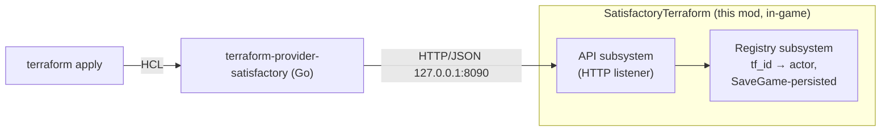

# SatisfactoryTerraform

[](https://github.com/daroco/SatisfactoryTerraform/actions/workflows/mod-build.yml)
[](LICENSE)
[](https://ficsit.app/mod/SatisfactoryTerraform)

**Factory-as-code for Satisfactory.** This mod runs a small HTTP API inside a
running game session so you can place, configure, and dismantle buildings,
belts, and power lines with [Terraform](https://www.terraform.io/) — declare
your factory in `.tf` files, `terraform apply`, and the world updates to match.
Griefed or hand-dismantled something? The next `plan` shows it as drift and
`apply` rebuilds it.

It is the **in-game half** of a two-repo project. The other half is the
[**terraform-provider-satisfactory**](https://github.com/daroco/terraform-provider-satisfactory)
— the Terraform provider (Go), the API contract
([`api/openapi.yaml`](https://github.com/daroco/terraform-provider-satisfactory/blob/main/api/openapi.yaml),
the single source of truth), and the example factories. This mod implements
that contract; the provider is its only intended client.

> **This is a control plane, not a read-only feed.** The API can build and
> dismantle anything in your world. It binds to loopback only and ships CSRF
> hardening, but read [Security](#security) before exposing the port anywhere.

## Install

**Recommended — Satisfactory Mod Manager (SMM):** search for
*SatisfactoryTerraform* in [SMM](https://docs.ficsit.app/satisfactory-modding/latest/ForUsers/SatisfactoryModManager.html)
and install. SMM handles SML and the correct game version for you.

**Manual:** download `SatisfactoryTerraform-<version>.zip` from the
[latest release](https://github.com/daroco/SatisfactoryTerraform/releases/latest)
(or from [ficsit.app](https://ficsit.app/mod/SatisfactoryTerraform)) and extract
it so the `.uplugin` lands at:

```
<Satisfactory install>/FactoryGame/Mods/SatisfactoryTerraform/SatisfactoryTerraform.uplugin
```

Requires [Satisfactory Mod Loader (SML)](https://ficsit.app/mod/SML) 3.11+.

## Quickstart

1. Install the mod (above) and load a save. The mod starts an HTTP listener on
   `127.0.0.1:8090`. The startup log line states the posture, e.g.
   `API listening on 127.0.0.1:8090 (loopback only; ... no auth token set)`.

2. Smoke-test it with `curl` — health, then spawn one constructor:

   ```sh
   curl http://localhost:8090/api/v1/health

   curl -X POST http://localhost:8090/api/v1/buildables \
     -H 'Content-Type: application/json' \
     -d '{"tf_id":"smoke-1","class":"Build_ConstructorMk1_C","transform":{"x":0,"y":0,"z":30000}}'
   ```

3. For real use, drive it with Terraform via the
   [provider](https://github.com/daroco/terraform-provider-satisfactory) and its
   examples (e.g. `examples/iron-plate-line` builds 4 foundations, a smelter and
   constructor, a belt, and a power line). Identity is a provider-generated
   `tf_id`, persisted in your save, so plans stay clean across save/load.

## How it works



The mod is three UE subsystems/modules under
[`Source/SatisfactoryTerraform/`](Source/SatisfactoryTerraform):

- **`STFApiServerSubsystem`** — the HTTP listener (UE `HTTPServer`), route
  handlers, and all spawn/patch/dismantle logic.
- **`STFRegistrySubsystem`** — the `tf_id → actor` / lightweight-record /
  connection-endpoint maps, persisted in the save game so identity survives
  save/load and restarts.
- **`STFGameWorldModule`** — the SML root game-world module that registers both.

Deeper design docs:

- [`docs/architecture.md`](docs/architecture.md) — the request lifecycle,
  the contract, identity & drift, and the trust boundary.
- [`docs/implementation-notes.md`](docs/implementation-notes.md) — the war
  stories behind the non-obvious code: lightweight buildables and their
  session-boundary self-heal, belt/wire hookup, the placement offset, route
  rebinding across save switches, and the conveyor-attachment dismantle crash.
  **Read the relevant section before touching that code.**

## Status

Milestones M0–M3 are done and verified live end-to-end: `terraform apply` on
`examples/iron-plate-line` creates all 8 resources (4 foundations, 2 buildings,
a belt, a power line) against a running session, and the next `plan` shows zero
drift.

- [x] Plugin/module scaffolding, SML root game-world module
- [x] Loopback HTTP listener, bearer-token auth, JSON helpers
- [x] Registry persisting `tf_id → actor`/lightweight-ref/connection endpoints
- [x] `GET /health`, `GET /world`, buildable spawn/read/list/delete
- [x] Path-parameter routing (`/api/v1/buildables/:tf_id`)
- [x] `PATCH` recipe/clock on manufacturers (M2)
- [x] Asset-registry class resolution (M2)
- [x] Proper dismantle via `IFGDismantleInterface`, with a `Destroy()` fallback (M2)
- [x] Lightweight-buildable tracking + session-boundary self-heal (M2)
- [x] Belts & power lines (M3)
- [x] Read-only export endpoints: `GET /players`, `GET /world/buildables`
      (everything near a point, tracked or not, with the belt/wire connection
      graph) - the data an exporter needs to turn a hand-built factory into
      configuration
- [ ] Fluid pipelines & hypertubes - implemented and compiling, **not yet
      verified in a live session** (see implementation notes)

See [`CHANGELOG.md`](CHANGELOG.md) for the release history.

## Security

The API can build and dismantle anything in the world, so treat the port as
a control plane, not a read-only feed. `CheckRequest` / `CheckTransport` in
`STFApiServerSubsystem.cpp` gate every request; the layers, and what each
stops:

| Attack path | Stopped by |
|---|---|
| Remote host on the LAN / internet | Loopback bind (the listener is not reachable off-machine at all) |
| Malicious web page, plain cross-origin | `Origin` rejection + JSON `Content-Type` requirement |
| Malicious web page via DNS rebinding | `Host` allowlist |
| A tunnel someone forwards to the port (`ssh -L 8090:localhost:8090 …`) | Bearer token — the forwarded connection arrives as loopback with a `localhost` Host, so it passes every CSRF check; the token is the only thing left |
| Another local process running as you | Bearer token, weakly (it can read the env var); not fully solvable here |

- **Loopback only.** `BeginPlay` pins the listener to `127.0.0.1` via a
  per-port `ListenerOverrides` entry before `GetHttpRouter` creates it.
  Load-bearing: UE's own code default is `localhost`, but FactoryGame's
  engine config overrides `DefaultBindAddress` to `any`, so without the pin
  the listener comes up on `0.0.0.0` and answers unauthenticated requests
  from any host on the LAN (confirmed live — a full factory listing was
  retrieved from another machine). The override targets only this mod's
  port, leaving other listeners alone.
- **CSRF hardening**, applied to every request including `/health`
  (`CheckTransport`): the `Host` header must be loopback (defeats DNS
  rebinding, where a page reaches `127.0.0.1` under an attacker hostname);
  any `Origin` header is rejected (the Terraform client never sends one, a
  cross-origin browser always does); and mutating verbs must send
  `Content-Type: application/json` (`text/plain`/form/multipart are CORS
  "simple" types a page can POST without a preflight, so requiring JSON
  forces a preflight this server never answers). None of these inconvenience
  the Go client, which already sends JSON and no `Origin`.
- **Bearer token**, optional and **empty by default** (`CheckRequest`). When
  set, every `/api/v1` request except `/health` needs
  `Authorization: Bearer <token>`. For plain single-player it is not needed —
  the loopback bind and CSRF layer already cover the reachable threats — so
  it is defense-in-depth there. It becomes the *only* guard the moment the
  port is reachable through something that presents as loopback, the tunnel
  case above; set one before doing that. Configure it by exporting
  `SATISFACTORY_TOKEN` before launching the game (`BeginPlay` reads it when
  the config value is empty); the Terraform provider reads the same variable,
  so one value configures both halves. The environment is captured at process
  start, so restart the game (and Steam, since it spawns the game) after
  changing it.

  (Binding beyond loopback — e.g. a dedicated server on `0.0.0.0` — is not a
  supported configuration yet: `BeginPlay` pins the bind unconditionally.
  When that lands, the `Host` allowlist will need to relax in tandem.)
- The startup log states the posture for at-a-glance audit:
  `API listening on 127.0.0.1:8090 (loopback only; host-allowlist + CSRF guards active; no auth token set)`.

To report a vulnerability, follow [`SECURITY.md`](SECURITY.md) — please do not
open a public issue.

## Building locally

You only need this to develop the mod; users install the packaged release.

1. Follow the [Satisfactory modding docs](https://docs.ficsit.app/) beginner
   guide: custom engine (`satisfactorymodding/UnrealEngine`), Visual Studio
   2022, Wwise, and the SML starter project.
2. Copy (or junction) this repo (the plugin root) to
   `<starter-project>/Mods/SatisfactoryTerraform/`.
3. Open the project, let it compile, then package with Alpakit.

CI does the same thing on a self-hosted runner — see
[`.github/workflows/mod-build.yml`](.github/workflows/mod-build.yml) and
[`docs/mod-ci.md`](docs/mod-ci.md) (which also documents cutting a release and
publishing to ficsit.app).

## Contributing

Bug reports, features, and PRs are welcome — start with
[`CONTRIBUTING.md`](CONTRIBUTING.md). Note that this mod **cannot be compiled in
most local setups** (it needs Satisfactory's custom engine) and that anything
touching the API shape starts in the
[provider repo's](https://github.com/daroco/terraform-provider-satisfactory)
contract.

## License

[MPL-2.0](LICENSE).
